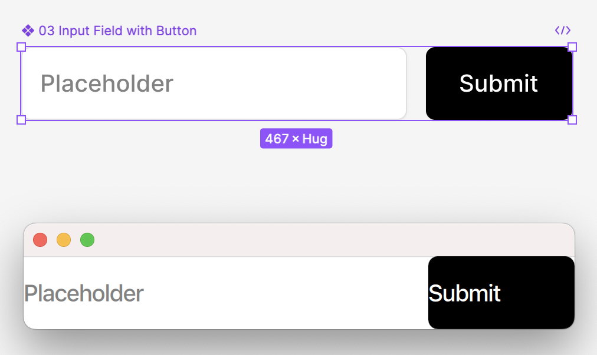

# Figma code generation

This is an illustrative example of how QML components can be generated from Figma components. The purpose of this project is to show (in a simplified way) how code generation of the components can be achieved.




## Build and run

```bash
go build
./figma_playground -fileKey FILE_KEY -componentId COMPONENT_ID -apiKey API_KEY
```
